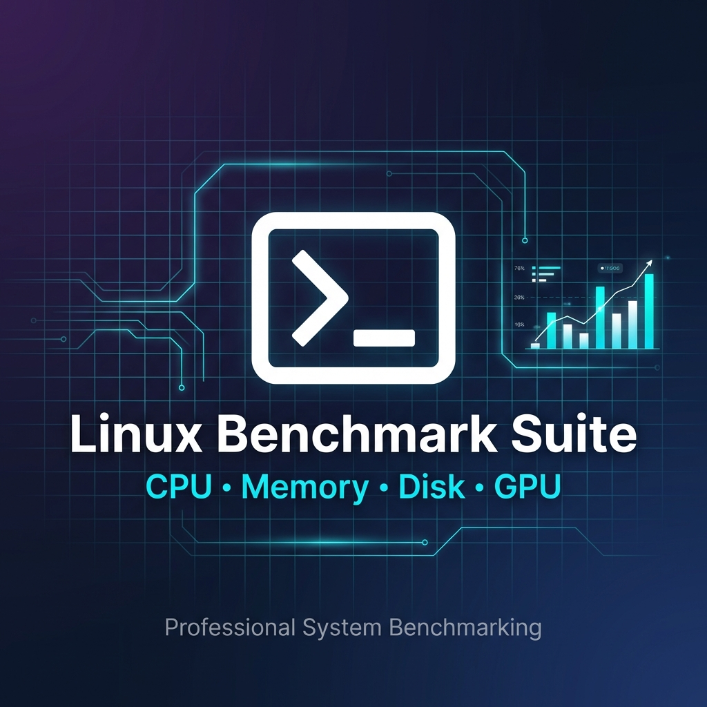

<div align="center">



# Linux Benchmark Suite

**The professional standard for system benchmarking on Linux.**
*One command. Comprehensive analysis. Enterprise-grade reporting.*

[](https://github.com/arintsohaib/linux-benchmark-suite/actions/workflows/ci.yml)
[](https://opensource.org/licenses/MIT)
[](https://www.debian.org/)
[](https://ubuntu.com/)
[](https://www.gnu.org/)
[](https://github.com/)
[](https://github.com/arintsohaib/linux-benchmark-suite/releases)

[Quick Start](#-quick-start) • [Features](#-what-it-does) • [GPU Benchmarks](#-gpu-benchmarks-new) • [Sample Results](#-sample-results)

</div>

---

## ⚡ What It Does

Run a single command and get a **comprehensive performance report** of your entire system:

```bash
sudo ./benchmark.sh
```

✅ **CPU** – Single & multi-thread performance with scaling efficiency  
✅ **Memory** – Read/write bandwidth and operations per second  
✅ **Disk** – Sequential & random I/O, IOPS, latency  
✅ **GPU** – Video acceleration, compute capabilities, frequencies *(NEW!)*  
✅ **Stress Test** – Full system stability testing  

---

## 🎯 Why Use This?

| Problem | Solution |
|---------|----------|
| **"Is my server performing well?"** | Get objective benchmark scores to compare |
| **"My app is slow, is it the hardware?"** | Identify CPU/memory/disk bottlenecks |
| **"Does my GPU support hardware decoding?"** | Auto-detect VA-API & OpenCL capabilities |
| **"I need professional reports for clients"** | Export stunning HTML, JSON, and TXT reports |
| **"Setting up benchmarks is complicated"** | One command, auto-installs dependencies |

---

## 🆕 GPU Benchmarks (NEW!)

> **Now with full GPU support for Intel, AMD, and NVIDIA!**

```bash
sudo ./benchmark.sh --with-gpu
```

| GPU Type | What's Tested |
|----------|---------------|
| **Intel iGPU** | VA-API profiles, frequency range, UHD/Iris/Arc |
| **AMD Radeon** | Temperature, power draw, OpenCL compute |
| **NVIDIA** | VRAM, CUDA, temperature, utilization |

### Sample GPU Output:
```
▶ Intel GPU Benchmark
─────────────────────────────────────────
  GPU: Intel UHD Graphics 770
  ✓ VA-API: 36 profiles available (H.264, HEVC, VP9, AV1)
  ✓ Frequency: 300 - 1,450 MHz
  ✓ Driver: Intel iHD v25.2.3
```

---

## 📊 Sample Results

*Tested on Intel Core i5-12500, 64GB DDR4, Enterprise NVMe*

### �️ CPU Performance
| Metric | Score |
|--------|-------|
| Single-thread | **1,517** events/sec |
| Multi-thread (12 cores) | **8,537** events/sec |
| Scaling Efficiency | **5.62x** (47% per core) |

### 🧠 Memory Bandwidth
| Operation | Speed |
|-----------|-------|
| Read | **77 GB/s** |
| Write | **18.6 GB/s** |

### � Storage I/O
| Test | Performance |
|------|-------------|
| Sequential Read | **14.4 GB/s** |
| Sequential Write | **8.3 GB/s** |
| Random 4K Read | **3.58M IOPS** |
| Random 4K Write | **3.24M IOPS** |

### 🎮 GPU (Intel UHD 770)
| Capability | Result |
|------------|--------|
| VA-API Profiles | **36** (H.264, HEVC, VP9, AV1) |
| Frequency Range | **300 - 1,450 MHz** |
| Video Decode | ✅ Hardware accelerated |

### 📁 View Sample Output Files

> **See exactly what your reports will look like!**

| Format | Preview | Description |
|--------|---------|-------------|
| 📊 [**HTML Report**](samples/results.html) | [View in Browser](https://htmlpreview.github.io/?https://github.com/arintsohaib/linux-benchmark-suite/blob/main/samples/results.html) | Interactive charts, dark theme |
| 📋 [**Text Report**](samples/results.txt) | ASCII-boxed terminal output | |
| 🔧 [**JSON Data**](samples/results.json) | Machine-readable format | |

<details>
<summary>📝 <b>Preview: Text Report Output</b> (click to expand)</summary>

```
╔══════════════════════════════════════════════════════════════════════╗
║                    LINUX BENCHMARK SUITE - RESULTS                   ║
╠══════════════════════════════════════════════════════════════════════╣
║  Generated: 2026-01-30 17:11:08                                      ║
╚══════════════════════════════════════════════════════════════════════╝

┌─────────────────────────────────────────────────────────────────────┐
│ SYSTEM INFORMATION                                                   │
├─────────────────────────────────────────────────────────────────────┤
│ OS:      Debian GNU/Linux 13 (trixie)                               │
│ Kernel:  6.12.63+deb13-amd64                                        │
│ CPU:     12th Gen Intel(R) Core(TM) i5-12500                        │
│ Cores:   12 cores / 12 threads                                      │
│ RAM:     64 GB                                                      │
└─────────────────────────────────────────────────────────────────────┘

┌─────────────────────────────────────────────────────────────────────┐
│ CPU BENCHMARK                                                        │
├─────────────────────────────────────────────────────────────────────┤
│ Single-thread:  1517.16 events/sec                                  │
│ Multi-thread:   8537.00 events/sec                                  │
└─────────────────────────────────────────────────────────────────────┘

┌─────────────────────────────────────────────────────────────────────┐
│ DISK BENCHMARK                                                       │
├─────────────────────────────────────────────────────────────────────┤
│ Sequential Read:   14376.98 MB/s                                    │
│ Sequential Write:  8309.15 MB/s                                     │
│ Random Read 4K:    3,578,843 IOPS                                   │
│ Random Write 4K:   3,236,036 IOPS                                   │
└─────────────────────────────────────────────────────────────────────┘
```

</details>

---

## 📦 Quick Start

```bash
# Clone the repository
git clone https://github.com/arintsohaib/linux-benchmark-suite.git
cd linux-benchmark-suite

# Run benchmarks (auto-installs dependencies)
sudo ./benchmark.sh

# Include GPU benchmarks
sudo ./benchmark.sh --with-gpu

# Quick test (skip stress test)
sudo ./benchmark.sh --skip-stress
```

---

## ⚙️ Command Options

```bash
sudo ./benchmark.sh [OPTIONS]
```

| Option | Description |
|--------|-------------|
| `-d, --duration=TIME` | Stress test duration (default: `10m`) |
| `-o, --output=DIR` | Custom output directory |
| `--with-gpu` | **🆕 Include GPU benchmark** |
| `--skip-cpu` | Skip CPU benchmark |
| `--skip-memory` | Skip memory benchmark |
| `--skip-disk` | Skip disk benchmark |
| `--skip-stress` | Skip stress test |
| `-y, --yes` | Non-interactive mode |
| `-h, --help` | Show help |

### Example Commands

```bash
# Full benchmark with GPU (recommended)
sudo ./benchmark.sh --with-gpu

# 30-minute stress test
sudo ./benchmark.sh --duration=30m

# Quick benchmark (CPU/memory/disk only, ~3 minutes)
sudo ./benchmark.sh --skip-stress

# Automated CI/CD pipeline
sudo ./benchmark.sh -y --skip-upgrade --output=/var/log/benchmarks
```

---

## � Output Files

Results are saved to the `output/` directory:

| File | Format | Use Case |
|------|--------|----------|
| `results.html` | 🎨 Visual Report | Share with stakeholders, browser viewing |
| `results.json` | 📊 Machine-readable | CI/CD integration, data analysis |
| `results.txt` | 📝 Plain text | Terminal viewing, email reports |

### HTML Report Features

- 🌙 **Dark Mode** – Easy on the eyes
- 📈 **Interactive Charts** – Chart.js visualizations
- ✨ **Glassmorphism UI** – Modern, premium design
- � **Responsive** – Works on desktop & mobile
- 📥 **Export** – Download raw JSON data

---

## 🔬 What's Tested

### CPU Benchmark
- Prime number calculation (sysbench)
- Single-threaded performance
- Multi-threaded scaling
- Core efficiency metrics

### Memory Benchmark
- Read/write operations per second
- Memory bandwidth (MiB/sec)
- Latency measurements

### Disk I/O Benchmark
- Sequential read/write (1MB blocks)
- Random read/write (4K blocks)
- IOPS and latency

### GPU Benchmark *(optional)*
- Auto-detects Intel/AMD/NVIDIA
- VA-API video acceleration profiles
- OpenCL compute capabilities
- GPU frequency and temperature

### Stress Test
- CPU stress (all cores)
- Memory stress
- I/O stress
- Configurable duration

---

## 🛠️ Requirements

- **OS**: Debian 12+, Ubuntu 22.04+, or any apt-based distro
- **Permissions**: Root/sudo access
- **Dependencies**: Auto-installed (sysbench, fio, stress-ng, jq)

---

## � Project Structure

```
linux-benchmark-suite/
├── benchmark.sh           # Main entry point
├── lib/
│   ├── utils.sh          # Logging & utilities
│   ├── deps.sh           # Dependency management
│   ├── cpu.sh            # CPU benchmarks
│   ├── memory.sh         # Memory benchmarks
│   ├── disk.sh           # Disk I/O benchmarks
│   ├── gpu.sh            # 🆕 GPU benchmarks
│   ├── stress.sh         # Stress testing
│   └── report.sh         # Report generation
├── templates/
│   └── report.html       # HTML report template
└── output/               # Generated reports
```

---

## 🤝 Contributing

Contributions welcome! Please feel free to submit issues and pull requests.

```bash
# Fork, then clone your fork
git clone https://github.com/YOUR_USERNAME/linux-benchmark-suite.git

# Create feature branch
git checkout -b feature/amazing-feature

# Commit and push
git commit -m "Add amazing feature"
git push origin feature/amazing-feature
```

---

## 🙏 Acknowledgments

This project is built on top of these amazing open-source tools:

| Tool | Purpose | Link |
|------|---------|------|
| **sysbench** | CPU & memory benchmarking | [github.com/akopytov/sysbench](https://github.com/akopytov/sysbench) |
| **fio** | Flexible I/O tester | [github.com/axboe/fio](https://github.com/axboe/fio) |
| **stress-ng** | System stress testing | [github.com/ColinIanKing/stress-ng](https://github.com/ColinIanKing/stress-ng) |
| **jq** | JSON processing | [github.com/stedolan/jq](https://github.com/stedolan/jq) |
| **Chart.js** | HTML report visualizations | [chartjs.org](https://www.chartjs.org/) |
| **intel-gpu-tools** | Intel GPU benchmarking | [gitlab.freedesktop.org/drm/igt-gpu-tools](https://gitlab.freedesktop.org/drm/igt-gpu-tools) |

---

## 📄 License

MIT License - See [LICENSE](LICENSE) for details.

---

<div align="center">

**⭐ Star this repo if you find it useful!**

Made with ❤️ for the Linux community

[Report Bug](https://github.com/arintsohaib/linux-benchmark-suite/issues) • [Request Feature](https://github.com/arintsohaib/linux-benchmark-suite/issues)

</div>
